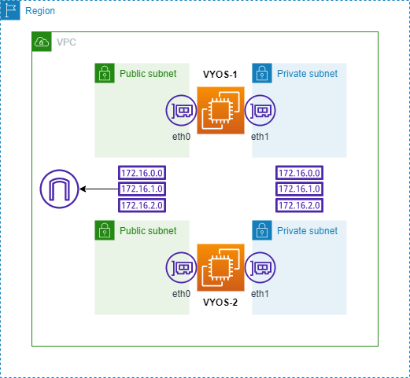

# VyOS-AWS-VROVR

**VORVR** is "Virtual Routing Over VRrp".

In short, this is a VyOS Handler for Routing on AWS, able to update AWS VPC Route Tables based on VRRP triggers.

Given this topology:



the VyOS VRRP Handler is able to update multiple AWS VPC Routing Tables on failover.

This is required to guarantee reachability of subnets behind VyOS (i.e., VPNs, ...).

Additionally, the handler is able to insert local kernel routes, that can be used to influence routing on VyOS itself (i.e., announcing the VPC subnet via BGP only from the active node).

**NOTE**: it works with VyOS 1.4.

## Handler Installation

Just SCP/copy the `vrovr.bash` file on `/config/scripts/` of your VyOS EC2 instance.

## VyOS Configuration

This is the minimum configuration for the VyOS instances:

```
set high-availability vrrp group AWS address 192.0.2.1/32 interface 'dum60'
set high-availability vrrp group AWS hello-source-address '172.31.31.247'
set high-availability vrrp group AWS interface 'eth0'
set high-availability vrrp group AWS peer-address '172.31.33.80'
set high-availability vrrp group AWS transition-script backup '/config/scripts/vrovr.bash fail'
set high-availability vrrp group AWS transition-script fault '/config/scripts/vrovr.bash fail'
set high-availability vrrp group AWS transition-script master '/config/scripts/vrovr.bash active'
set high-availability vrrp group AWS transition-script stop '/config/scripts/vrovr.bash fail'
set high-availability vrrp group AWS vrid '10'
```

**NOTE**: VRRP unicast addressing is used. It's important that you set the proper addresses on *hello-source-address* and *peer-address*.

**NOTE**: The VRRP configuration will set a *dummy* Virtual IP. This, of course, has no sense in the AWS Routing context.

## Handler Configuration

Right now, the only way to configure the handler is to edit the bash file itself.

You will find the following array variables:
* local_routes
* cloud_routes

## local_routes
Here you can define the subnets that the handler will insert in the kernel routing table. These routes will be inserted on VRRP *Master* state, and removed on VRRP *Backup* (or failed) state.

The syntax is: `<VRF-Name>:<Route>:<Interface>`.

Example:
```
local_routes[0]='TELCO:172.31.240.0/20:eth1'
```

## cloud_routes
Here you can define the subnets that the handler will update on the AWS VPC Routing Tables. These routes will be **updated** on VRRP *Master* state.

It is required that the defined routes are already present on the VPC Routing Tables (the handler invokes only the *ec2 replace-route* API). It is also required that the VyOS EC2 instances have an AMI role that allow them calling ec2 API (and, of course, API endpoint reachability).

The handler can manage both plain routes and *AWS Prefix Lists*.

The syntax is: `<Route>:<Interface>:<Routing-Table>`.

Example:
```
cloud_routes[0]='10.10.10.0/24:eth1:rtb-02127b9821a520aaf'
cloud_routes[1]='pl-0fd84df436a7a4745:eth1:rtb-02127b9821a520aaf'
```
